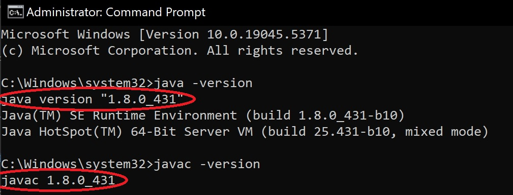

[](https://travis-ci.org/openmrs/openmrs-core) [](https://coveralls.io/github/openmrs/openmrs-core?branch=master) [](https://www.codacy.com/app/openmrs/openmrs-core?utm_source=github.com&amp;utm_medium=referral&amp;utm_content=openmrs/openmrs-core&amp;utm_campaign=Badge_Grade)

api: [](https://snyk.io/test/github/openmrs/openmrs-core?targetFile=api%2Fpom.xml)
test: [](https://snyk.io/test/github/openmrs/openmrs-core?targetFile=test%2Fpom.xml)
tools: [](https://snyk.io/test/github/openmrs/openmrs-core?targetFile=tools%2Fpom.xml)
web: [](https://snyk.io/test/github/openmrs/openmrs-core?targetFile=web%2Fpom.xml)
webapp: [](https://snyk.io/test/github/openmrs/openmrs-core?targetFile=webapp%2Fpom.xml)

OpenMRS is a patient-based medical record system focusing on giving providers a free customizable electronic medical record system (EMR).

The mission of OpenMRS is to improve health care delivery in resource-constrained environments by coordinating a global community that creates a robust, scalable, user-driven, open source medical record system platform.

#### Table of Contents

1. [Build](#build)
   1. [Prerequisites](#prerequisites)
   2. [Build Command](#build-command)
   3. [Deploy](#deploy)
2. [Docker build](#docker-build)
3. [Navigating the repository](#navigating-the-repository)
4. [Software Development Kit](#software-development-kit)
5. [Extending OpenMRS with Modules](#extending-openmrs-with-modules)
6. [Documentation](#documentation)
   1. [Developer guides](#developer-guides)
   2. [Wiki](#wiki)
   3. [Website](#website)
7. [Contributing](#contributing)
   1. [Code](#code)
   2. [Code Reviews](#code-reviews)
   3. [Translation](#translation)
8. [Issues](#issues)
9. [Community](#community)
10. [Support](#support)
11. [License](#license)

## Build

### Prerequisites

#### Java

OpenMRS is a Java application which is why you need to install a Java JDK.

For my Windows environment, only JDK version 8 works. 

To download JDK 8, you must register on Oracle: [JDK 8 Download](https://www.oracle.com/java/technologies/javase/javase8u211-later-archive-downloads.html).


After installation, add JDK 8 to the PATH environment variable.

To verify the installation, open Command Prompt as an administrator and run:

```bash
java -version
javac -version
```


#### Maven

Install the build tool [Maven](https://maven.apache.org/).
Downloads the

Follow this link to install Maven [Install Maven](https://phoenixnap.com/kb/install-maven-windows)

You need to ensure that Maven uses the Java JDK needed for the branch you want to build.

To do so execute

```bash
mvn -version
```

which will tell you what version Maven is using. Refer to the [Maven docs](https://maven.apache.org/configure.html) if you need to configure Maven.

#### Git

Install the version control tool [git](https://git-scm.com/) and clone this repository with

```bash
git clone https://github.com/openmrs/openmrs-core.git
```

### Build Command

After you have taken care of the [Prerequisites](#prerequisites)

Execute the following

```bash
cd openmrs-core
mvn clean package
```

This will generate the OpenMRS application in `webapp/target/openmrs.war` which you will have to deploy into an application server like for example [tomcat](https://tomcat.apache.org/) or [jetty](http://www.eclipse.org/jetty/).

### Deploy

For development purposes you can simply deploy the `openmrs.war` into the application server jetty via

```bash
cd openmrs-core/webapp
mvn jetty:run
```

If all goes well (check the console output) you can access the OpenMRS application at `localhost:8080/openmrs`.

Refer to [Getting Started as a Developer - Maven](https://wiki.openmrs.org/display/docs/Maven) for some more information
on useful Maven commands and build options.

### Fixing Missing User Interface Module in OpenMRS

If you encounter the issue where "OpenMRS documentation platform is running successfully, but no user interface module is installed," follow these steps:

1. Download [OpenMRS LegacyUI Module](https://github.com/openmrs/openmrs-module-legacyui)
   ```bash
   git clone https://github.com/openmrs/openmrs-module-legacyui.git
   cd openmrs-module-legacyui/
   ```
2. Install the Legacy UI Module

   Navigate to:`openmrs-module-legacyui/omod/target`

   Copy the file: `legacyui-1.23.0-SNAPSHOT.omod`

   Paste it into: `C:\Users\YourUsername\AppData\Roaming\OpenMRS\Modules`

3. Build and Deploy the Module

   ```bash
   mvn clean install
   ```
Once completed, you can access the OpenMRS application at: [localhost:8080/openmrs](http://localhost:8080/openmrs)

Login Credentials

      Username: `admin`

      Password: `Admin123`