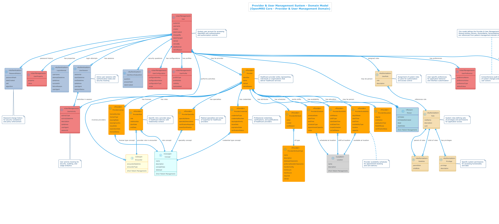

# OpenMRS PlantUML Diagrams Index

This directory contains automatically generated images from PlantUML source files.

## Generated Images

### APIResources/OpenMRS API Resource Model

### Conceptual/Clinical Data Management System - Domain Model

### Conceptual/Clinical Decision Support System - Domain Model

### Conceptual/Cohort Management System - Domain Model

### Conceptual/Location & Facility Management System - Domain Model

### Conceptual/Medication Dispensing System - Domain Model

### Conceptual/Messaging & Communication System - Domain Model

### Conceptual/Order Management System - Domain Model

### Conceptual/Patient Management System - Domain Model

### Conceptual/Provider & User Management System - Domain Model

### Conceptual/Visit Management System - Domain Model

### DB/OpenMRS_Clinical_Concepts_and_Terminology_Domain

### DB/OpenMRS_Clinical_Encounters_and_Observations_Domain

### DB/OpenMRS_Complete_Database_Schema

### DB/OpenMRS_Conditions_and_Relationships_Domain

### DB/OpenMRS_Database_Schema

### DB/OpenMRS_Forms_and_Fields_Domain

### DB/OpenMRS_Orders_and_Medications_Domain

### DB/OpenMRS_Patient_Management_Domain

### DB/OpenMRS_Programs_and_Workflows_Domain

### DB/OpenMRS_Users

### DB/OpenMRS_Visits_and_Locations_Domain

### OpenMRS Core Architecture - Component Diagram

### OpenMRS Core Dependencies

### OpenMRS Docker Deployment Architecture

### OpenMRS Program Workflow State Machine - Detailed

### OpenMRS State Machines

### statetransitions/Condition Clinical Status State Machine

### statetransitions/Condition Verification Status State Machine

### statetransitions/HL7 Message Processing State Machine

### statetransitions/OpenMRS Program Workflow State Machine - Detailed

### statetransitions/OpenMRS State Machines

### statetransitions/Order Fulfiller Status State Machine

### statetransitions/Patient State Integration

### statetransitions/Program Workflow State Machine

