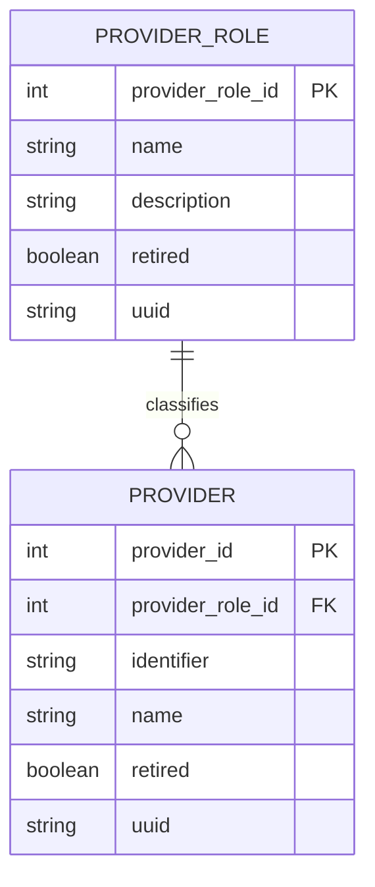

# Provider Role Name Lookup

## Summary

This feature adds `ProviderService#getProviderRoleByName(String name)` so platform code and modules can resolve a `ProviderRole` by its configured name, not only by numeric ID or UUID.

Provider roles are already first-class metadata in OpenMRS. They are attached to `Provider` records and are commonly configured by administrators using human-readable names such as `Cell supervisor` or `Health center supervisor`. A name lookup method keeps provider role access consistent with similar metadata APIs, including `EncounterService#getEncounterRoleByName(String name)`.

## API Contract

```java
ProviderRole role = Context.getProviderService().getProviderRoleByName("Cell supervisor");
```

The method uses exact name matching. It returns the matching `ProviderRole`, or `null` when no role has the requested name. Retired roles are still returned because metadata name resolution may be needed for historical configuration and migration workflows.

## Entity Relationship



## Implementation Notes

- `ProviderService` exposes the public authorized API.
- `ProviderServiceImpl` delegates the lookup to `ProviderDAO`.
- `ProviderDAO` defines the persistence boundary.
- `HibernateProviderDAO` performs the exact name query using JPA Criteria.
- Service and DAO tests cover both the successful lookup and missing-role behavior.

## Verification

Run the focused provider tests:

```bash
./mvnw -pl api -Dtest=ProviderServiceTest,ProviderDAOTest test
```
